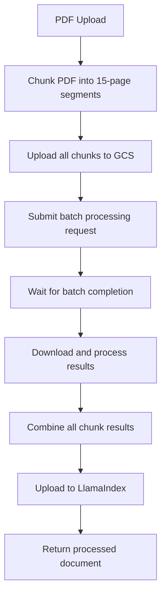

# Document AI Batch Processing Implementation

## Overview

This implementation modifies the existing PDF processing workflow to use Google Cloud Document AI's batch processing capabilities instead of processing chunks individually. This approach is more efficient and cost-effective for processing large documents.

## Key Changes

### 1. PDF Chunking (Unchanged)
- Documents are still split into 15-page chunks using PDF-lib
- Each chunk maintains proper page numbering and structure

### 2. Google Cloud Storage Upload (New)
- All PDF chunks are uploaded to Google Cloud Storage before processing
- Chunks are organized in a structured folder hierarchy:
  ```
  paradigms-documents/
  ├── chunks/
  │   └── {userId}/
  │       ├── document_chunk_1.pdf
  │       ├── document_chunk_2.pdf
  │       └── document_chunk_N.pdf
  ```

### 3. Batch Processing (Modified)
- Uses Document AI's batch processing API instead of individual processing
- All chunks are processed in a single batch operation
- Results are stored in Google Cloud Storage and downloaded automatically
- Supports concurrent processing of multiple documents

### 4. Result Processing (Enhanced)
- Results from all chunks are combined into a single document
- Page offsets are properly calculated to maintain document structure
- Enhanced entity extraction with proper page references

## Architecture Flow



## Benefits

### Performance
- **Parallel Processing**: All chunks processed simultaneously instead of sequentially
- **Reduced Latency**: Single batch operation vs multiple individual requests
- **Better Resource Utilization**: Document AI optimizes batch processing internally

### Cost Efficiency
- **Batch Pricing**: Google Cloud Document AI offers better pricing for batch operations
- **Reduced API Calls**: One batch request instead of N individual requests
- **Storage Optimization**: Temporary files stored in GCS and cleaned up automatically

### Reliability
- **Error Handling**: Better error recovery for individual chunk failures
- **Monitoring**: Comprehensive logging for each stage of processing
- **Retry Logic**: Built-in retry mechanisms for failed operations

## Configuration

### Required Environment Variables
```bash
LLAMA_CLOUD_API_KEY=your_llama_cloud_api_key
GOOGLE_APPLICATION_CREDENTIALS=path_to_service_account_json
```

### Google Cloud Setup
1. **Document AI Processor**: 
   - Project ID: `39073705270`
   - Location: `us`
   - Processor ID: `83aeafbc915376ac`

2. **Cloud Storage Bucket**: 
   - Bucket Name: `paradigms-documents`
   - Location: `us`
   - Permissions: Read/Write for service account

### Service Account Permissions
The service account needs the following roles:
- Document AI API User
- Storage Object Admin
- Storage Bucket Viewer

## API Endpoint

### POST `/api/nparse`

#### Request Body
```json
{
  "fileName": "document.pdf",
  "bucketName": "your-supabase-bucket",
  "uploadPath": "path/to/document.pdf",
  "userId": "user-123"
}
```

#### Response
```json
{
  "message": "File parsed and uploaded successfully with Google Document AI (Batch Processing) - Processed 5/5 chunks",
  "documentsCreated": 1,
  "llamaIndexUploaded": true,
  "indexingCompleted": true,
  "parsedJsonPath": "path/to/parsed.json",
  "ocrMethod": "gemini-ocr-batch-processing",
  "chunksProcessed": 5,
  "totalChunks": 5,
  "gcsUrisUploaded": 5
}
```

## Error Handling

### Chunk Upload Failures
- Individual chunk upload failures are logged
- Processing continues with successfully uploaded chunks
- Minimum threshold ensures processing doesn't continue with too few chunks

### Batch Processing Failures
- Comprehensive error logging for batch operation failures
- Fallback mechanisms for partial results
- Automatic cleanup of temporary files

### Result Processing Failures
- Individual result file failures are logged
- Processing continues with valid results
- Final output includes success metrics

## Testing

Use the provided test file:
```bash
node test-batch-processing.js
```

Make sure to update the test configuration with your actual document details.

## Performance Metrics

### Before (Individual Processing)
- Processing Time: ~30-60 seconds per chunk
- API Calls: N (number of chunks)
- Concurrency: Limited by rate limits

### After (Batch Processing)
- Processing Time: ~60-120 seconds total (regardless of chunk count)
- API Calls: 1 batch request
- Concurrency: Unlimited (handled by Document AI)

## Monitoring and Logs

The implementation includes comprehensive logging:
- 📤 Upload progress for each chunk
- 🔄 Batch processing status
- 📥 Result download progress
- ✅ Success metrics and timing
- ❌ Detailed error information

## Future Enhancements

1. **Async Processing**: Implement webhook-based result retrieval
2. **Progress Tracking**: Real-time progress updates for large documents
3. **Result Caching**: Cache processed results for duplicate documents
4. **Auto-scaling**: Dynamic chunk size based on document complexity
5. **Multi-region**: Support for multiple Google Cloud regions

## Troubleshooting

### Common Issues

1. **GCS Upload Failures**
   - Check service account permissions
   - Verify bucket exists and is accessible
   - Check network connectivity

2. **Batch Processing Timeouts**
   - Large documents may take longer to process
   - Monitor Google Cloud Console for operation status
   - Increase timeout values if needed

3. **Result Download Failures**
   - Check GCS bucket permissions
   - Verify result files exist in expected location
   - Check for partial processing results

### Debug Mode
Set environment variable for detailed logging:
```bash
DEBUG=document-ai-batch
```

## Migration Notes

### From Individual Processing
- Existing processed documents remain compatible
- No database migration required
- API response format slightly modified to include batch metrics

### Backwards Compatibility
- All existing integrations continue to work
- New fields in response are optional
- Error handling maintains same interface
